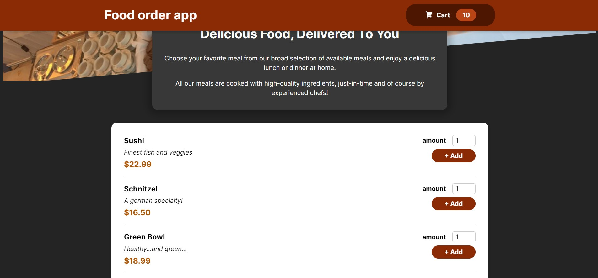
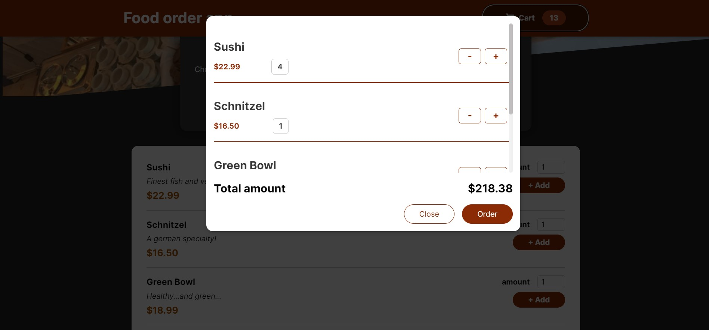
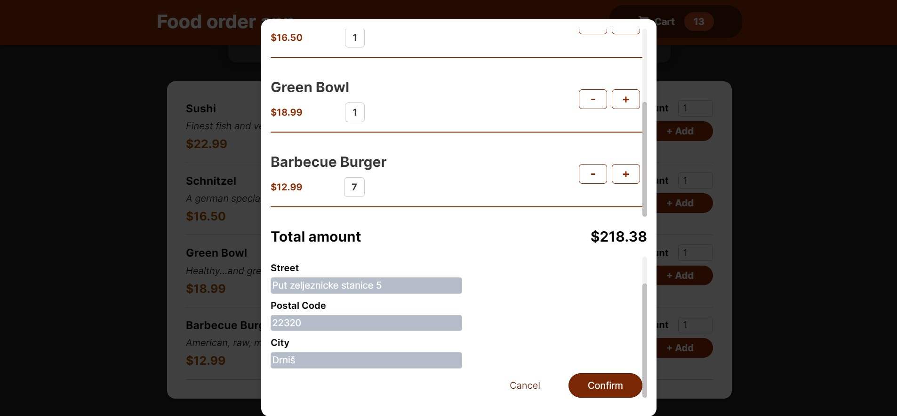
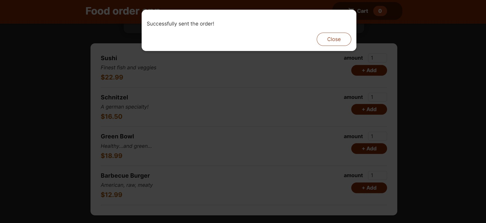

This is the Food order app where users can add the food items to the cart, edit the ordered amount, and then order the food. My main goal with this project was to practice using Context API and building custom hooks.

## Table of contents

- [The challenge](#the-challenge)
  - [Screenshot](#screenshot)
  - [Links](#links)
- [Built with](#built-with)
  - [What I learned](#what-i-learned)

### The challenge

All users should be able to:

- View the optimal layout for the app depending on their device's screen size
- Interact width the app by adding the food they want to order
- Edit the amount of food they want to order in multiple places in the app
- Submit the order to the database and receive a confirmation that the order was successful

### Screenshot

### Links

- Live Site URL: https://jure-reljanovic-food-order-app.netlify.app/

### Built with

- Firebase
- CSS Modules
- Custom Hooks
- [React](https://reactjs.org/)

### What I learned

I learned how to use Context API to manage the state all in one place. That helped me write cleaner code and avoid prop drilling. I also learned how to build custom hooks for validating input fields to avoid code repetition.
